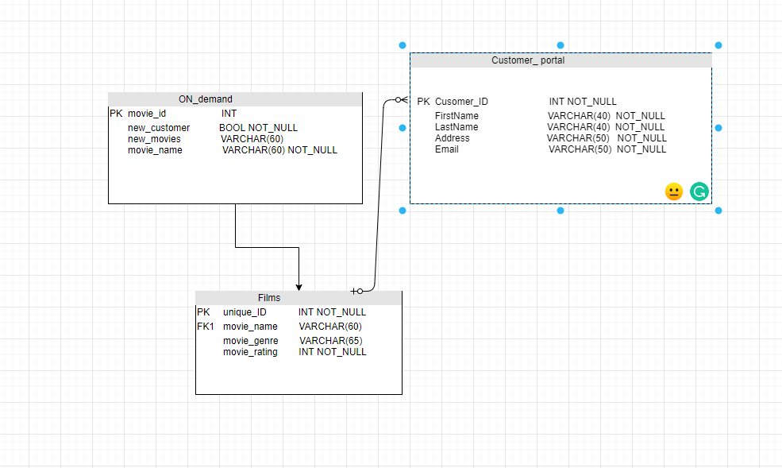
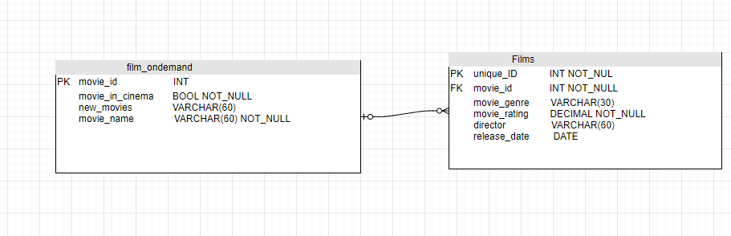
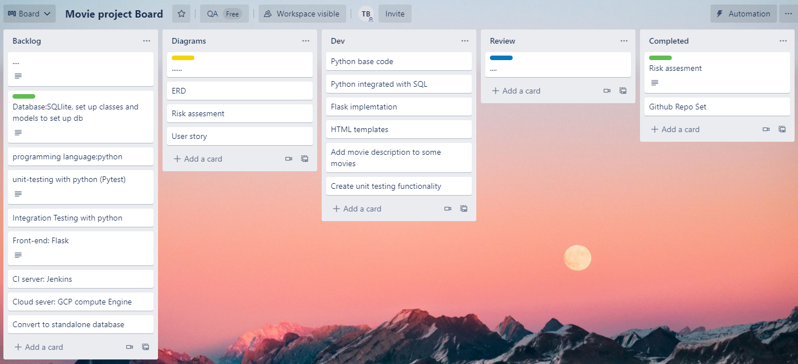
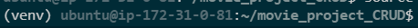
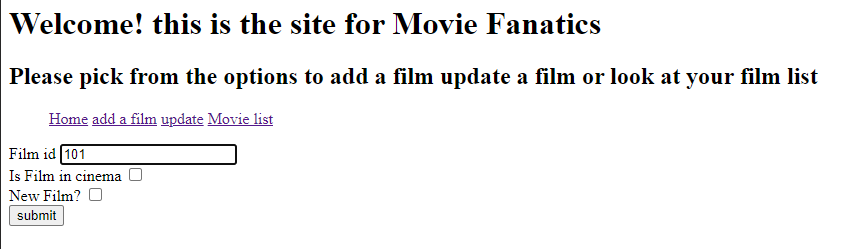
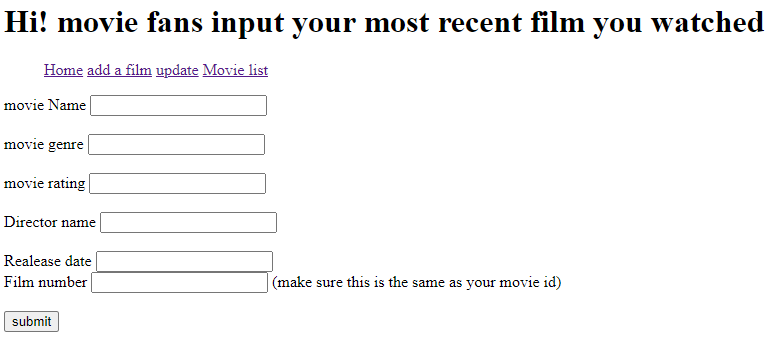
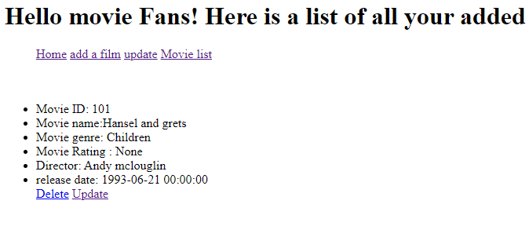
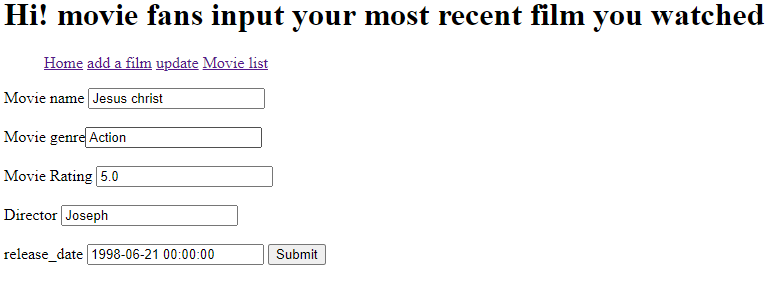
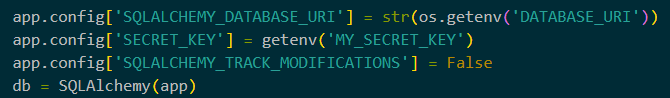

# movie_project
The aim of the project is to To create a CRUD application with the utilisation of supporting tools,
methodologies and technologies that encapsulate all core modules

# ERD design
At the planning of the project, I initially made a couple of database tables which I saw to be feasible for the scope of the project. As I was moving on to my risk assessment I quickly figured out that the database I wanted to make was a little bit too ambitious for my skills so I had to rethink how I wanted it to look. Prior Database below:

Upon some advice, the 'Customer_portal' table was taken out so I could reach the MVP for the scope of the project in time. This is the current ERD:

# Risk Assesment
My risk assessment shows the possible risk that may occur during the development of my project. This helps us to minimize any major faults or setbacks during the project:
![Risk_assesment])(images/Risk2.png) 
some fo the risks and measures i identifed was:

* App breaking code getting pushed up to the main branch, the measure for this was to double-check all code is working accordingly and having a backup file somewhere to revert to if things do go wrong.

* The secret key being uploaded to GitHub, this has a high impact level on the project and could be a data breach, to control this I will have gitignore and secret keys implemented before pushing to git hub

* App Virtual machine goes down, We can try and restore this by creating a new instance of the virtual machine and cloning from Github

# CI pipeline
Using a continuous integration pipeline was one of the constraints of the project, this is what we have been trying to implement through our project. The version control I used for my project was Github using this was an easy and clear way of sharing information and collaborating on software development. 

# Project Tracking 
 The project was tracked through a Kanban Trello board:
 
 The board shows the essentials of the project and the process should be moving from left to right as the development of the app progresses through the week.
 
  The backlog is where I stored the aspects I have yet to start, and after I start it relocates into another card which I can then place in the completed card. This visualises what I have done and gives me context on what i have to do next.

# Development
## CRUD
I set up a virtual environment hosted on an aws Ubuntu server, this is where I set up all my installs and requirements for my project.

* CRUD
Whilst creating the CRUD Functionality in flask I came across many obstacles, however, i ended up creating a minimalistic app that shows the users movie input, deletes it and updates it

This is where the user inputs a movie ID so it can relate to my second form and then the user can fill in details about the Id of the film, as you can see below 

Here is a form of where the user can input certain details about the details of the film like film_name 

Here the user can view all the inputs they have put in and from here users can edit, and delete the movie IDs from the database. 

When the user wants to update the film list they are redirected into the update form, this shows the fields that they can update after this is done the app redirects back to the movie list so they can see the changes made.

Jinja was used to create my HTML files, so the app can display on the screen in readable format for the user to use, No CSS or bootstrap was used this time. this could have been a section I would have implemented however I felt that other aspects of the project were more important.
## Database
At the beginning of my project I was working on the inbuilt database sqlite, this had all the functionality I wanted it to, however towards the end, I changed to a standalone rds database on AWS, this starts to use the memory from my EC2 rather than my sqlite in build database. The database and my virtual machine are talking to each other, to do this I had to write a connection string that links the two together.

As you can see my connection string is hidden if this case and I pushed into GitHub anyone would have been able to work out the location of my db and my username and password. To counter this I used the os getenv method, which hides confidential code. Then all I have to do is export my 'DATABASE_URI' and my 'SECRET_KEY' then the db is more secure.
# Testing 
Testing was an essential part of the app, this made sure that the app was running the way it is intended. However, this is the side of the project I encountered a lot of errors with so the testing was not at a place I would have liked. Under the revision, the testing had breadcrumbs leading to the start of the project.

Aligned with the Trello board and time I had left the decision was to try and reach the MVP of the scope. Below is the start of the testing as I was testing to make sure the redirects on each page was working correctly, and showing as intended. 

## Intergration testing
Integration testing would have been added by setting up a Jenkins VM this would then be able to test and build my project autonomously through a freestyle project cloned down from Github.

## Future improements
* creating a more relatable db model that emcompases boththe models well
* implementing a cinema location if the user wants to go and see the film in  a specfic venu
* get further testing implemented into all my routes and pages
* Jenkins implemenation 